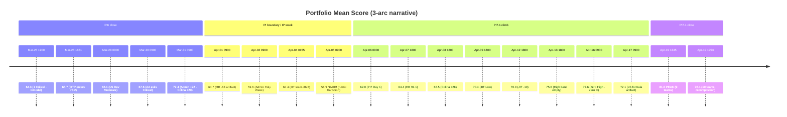
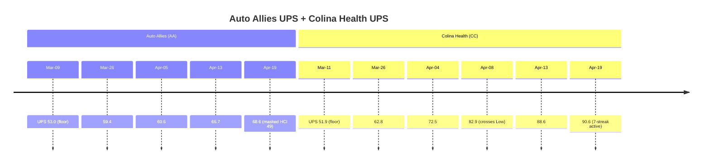

---
title: "Portfolio Trend — 2026-03-25 → 2026-04-19"
type: synthesis
tags: [portfolio, trend, safe, pi6, pi7]
sources:
  - "../summaries/portfolio-20260325-1900.md"
  - "../summaries/portfolio-20260326-1651.md"
  - "../summaries/portfolio-20260328-0900.md"
  - "../summaries/portfolio-20260330-0900.md"
  - "../summaries/portfolio-20260331-0900.md"
  - "../summaries/portfolio-20260401-0900.md"
  - "../summaries/portfolio-20260402-0900.md"
  - "../summaries/portfolio-20260404-0155.md"
  - "../summaries/portfolio-20260405-0900.md"
  - "../summaries/portfolio-20260406-0900.md"
  - "../summaries/portfolio-20260407-1800.md"
  - "../summaries/portfolio-20260408-1800.md"
  - "../summaries/portfolio-20260409-1800.md"
  - "../summaries/portfolio-20260412-1800.md"
  - "../summaries/portfolio-20260413-1800.md"
  - "../summaries/portfolio-20260416-0900.md"
  - "../summaries/portfolio-20260417-0900.md"
  - "../summaries/portfolio-20260419-1345.md"
  - "../summaries/portfolio-20260419-1953.md"
created: 2026-04-19

updated: 2026-04-24

# Portfolio Trend — 2026-03-25 → 2026-04-24

Cross-cutting synthesis of portfolio snapshots spanning **PI6 close → PI7.2 Day 5**. Goal: separate the signal (real team trajectories) from noise (rubric artifacts, scoring transitions, PI/holiday boundaries, recomposition).

## Headline

- **Mean trajectory:** 64.3 (03-25) → **81.0 peak** (04-19 13:45, 9-team) → 76.1 (04-19 19:53, 10-team recomposition).
- **Median trajectory:** 57.8 → **82.4 peak** (04-19 13:45) → 80.9 (19:53).
- **Critical band count:** 1 → 0 → 2 → 0 → 1 (reappeared when Shared Services joined).
- **First zero-Critical day:** 2026-03-30 (Auto Allies promoted out).
- **First zero-High day:** 2026-04-13.
- **First zero-High-and-Critical day:** 2026-04-16.

## Timeline

| Date (time) | Mean | Median | L | M | H | C | Event |
|-------------|-----:|-------:|--:|--:|--:|--:|-------|
| 2026-03-25 19:00 | 64.3 | 57.8 | 3 | 0 | 4 | 1 | Baseline; AA Dev Critical; OTP no-data |
| 2026-03-26 16:51 | 65.7 | 58.5 | 3 | 1 | 4 | 1 | OTP enters at 78.2 |
| 2026-03-28 09:00 | 66.1 | 60.3 | 3 | 2 | 3 | 1 | LS Dev +1.8 crosses into Moderate |
| 2026-03-30 09:00 | 67.6 | 60.3 | 3 | 2 | 4 | 0 | **Auto Allies exits Critical** (+11.3) — first zero-Critical |
| 2026-03-31 09:00 | 72.4 | 77.1 | 3 | 3 | 3 | 0 | Admin +22.1, Colina +19.5 → median jump +16.8 |
| *trend rollup* | — | — | — | — | — | — | Projected 77.7 / 79.5 by PI6 Day 14; +1.31/day slope |
| **2026-04-01 09:00** | 64.7 | 72.3 | 3 | 2 | 3 | 1 | 🚧 HR Low→Critical (-63.4) — scoring artifact after perfect 14/14 |
| 2026-04-02 09:00 | 59.6 | 59.2 | 3 | 1 | 3 | 2 | Admin evacuated for Holy Week/IP (-45.6) |
| 2026-04-04 01:55 | 60.4 | 61.4 | 4 | 1 | 2 | 2 | JIT leads portfolio 86.8 (+4.0); OTP back to Low |
| **2026-04-05 09:00** | 56.9 | 63.1 | 1 | 4 | 2 | 2 | 🚧 **Rubric transition 6-dim → 7-dim** — JIT -22.1, Finance -12.1 |
| 2026-04-06 09:00 | 62.0 | 66.9 | 0 | 5 | 4 | 0 | **PI7 Day 1 open**; HR +53.2, Admin +45.4 (largest positive deltas) |
| 2026-04-07 18:00 | 64.4 | 66.3 | 1 | 4 | 4 | 0 | HR 91.1 sole Low; Colina ICS drops on mid-sprint add |
| 2026-04-08 18:00 | 68.5 | 74.9 | 1 | 6 | 2 | 0 | Colina +28.3 High→Low; at-risk count 4→2 |
| 2026-04-09 18:00 | 70.4 | 75.6 | 2 | 5 | 2 | 0 | JIT promoted to Low (81.6); first Day-4 zero-Critical |
| 2026-04-12 18:00 | 70.0 | 71.1 | 2 | 5 | 2 | 0 | JIT -10.5 regression; portfolio flat |
| 2026-04-13 18:00 | 75.6 | 77.6 | 2 | 7 | 0 | 0 | **High band emptied**; Flawless +18.6 |
| 2026-04-16 09:00 | 77.6 | 78.4 | 4 | 5 | 0 | 0 | First zero-High-and-Critical; Auto Allies QA Crisis flagged |
| 2026-04-17 09:00 | 72.1 | 78.4 | 3 | 4 | 1 | 1 | 🚧 Life Style 77.1→11.2 (sprint-close formula artifact); AA color override |
| **2026-04-19 13:45** | 81.0 | 82.4 | 5 | 4 | 0 | 0 | 🎯 **Peak portfolio health** — first full-cycle zero-Critical |
| 2026-04-19 19:53 | 76.1 | 80.9 | 5 | 4 | 0 | 1 | 🔴 Shared Services joins (32.2) — 10-team recomposition |
| 2026-04-21 (7.2 D2) | 63.9 | — | 1 | — | — | — | 7.2 sprint reset — DP zeroes across portfolio; mean −12.2 |
| 2026-04-22 (7.2 D3) | 63.9 | — | 1 | — | — | — | Flat — degraded-data run (GitHub 404 on Git teams) |
| 2026-04-23 AM (D4) | 64.1 | — | 1 | — | — | — | +0.2 |
| 2026-04-23 PM (D4) | 64.6 | 68.0 | 1 | 6 | 2 | 1 | First upward tick; LS→Critical (band inversion with Shared) |
| **2026-04-24 (D5)** | **69.9** | — | 1 | 8 | 1 | **0** | 🎯 **Critical band cleared**; +5.3 in one snapshot (largest 7.2 jump); 2 upward band crossings (fl_dev High→Mod, ls_dev Critical→Mod) |

## Visual trend (Mermaid)

### Portfolio mean — three arcs

Trend of the portfolio's aggregate mean score across all audited teams. The `xychart-beta` Mermaid type isn't used here because Obsidian doesn't render it reliably (see root `../../CLAUDE.md`); `timeline` is the supported equivalent.



### Git-team UPS trajectories

Pure-UPS read — the two teams whose audits use [[concepts/scoring-git-ups]]. Auto Allies and Colina Health over the same window, highlighting the diverging engineering-health stories covered in [[synthesis/ups-masking-pattern]] and [[synthesis/github-compliance-issues]].



### Text sparkline — portfolio mean at a glance

Compact visualization of the 20-snapshot mean trajectory. Each block approximates the score relative to the 56.9–81.0 window range.

```
64.3 65.7 66.1 67.6 72.4 | 64.7 59.6 60.4 56.9 | 62.0 64.4 68.5 70.4 70.0 75.6 77.6 72.1 | 81.0 76.1
▄▄▄▄ ▄▄▄▄ ▄▄▄▄ ▅▄▄▄ ▅▅▅▅ | ▄▄▄▄ ▃▃▃▃ ▄▄▄▄ ▃▃▃▃ | ▄▄▄▄ ▄▄▄▄ ▄▄▄▄ ▅▄▄▄ ▅▄▄▄ ▅▅▅▅ ▆▆▅▅ ▅▄▄▄ | ▇▇▆▆ ▆▆▅▅
   PI6 close ↑          ↑ IP/Holy/rubric nadir   ↑ PI7.1 monotonic climb              ↑ peak → 10-team
```

**Headline numbers:**
- Start (Mar-25): **64.3** mean, **57.8** median
- Nadir (Apr-05): **56.9** mean, **63.1** median (rubric transition)
- Peak (Apr-19 13:45): **81.0** mean, **82.4** median
- Current (Apr-19 19:53 · 10-team): **76.1** mean, **80.9** median
- Window delta: **+11.8 mean · +23.1 median** (median grew faster — bottom-band teams pulled up)

## Themes

### 1. Three distinct arcs

- **PI6 close (03-25 → 03-31):** Mean +8.1 / median +19.3. Recovery from Q1 baseline, driven by Admin and Colina jumping multiple bands. Trend rollup projected sustained improvement into Day 14 (77.7 / 79.5) — over-optimistic given PI-boundary effects below.
- **PI boundary / IP week (04-01 → 04-05):** Portfolio regressed by ~15 mean points from the PI6 close high. Mix of (a) Holy Week / Innovation-Planning team evacuations, (b) a rubric change from 6-dim to 7-dim that broadly depressed scores, and (c) scoring artifacts at sprint-close (HR -63.4 after a perfect sprint).
- **PI7.1 arc (04-06 → 04-19 13:45):** Clean monotonic climb — mean 62.0 → 81.0 over 14 days, the cleanest trajectory in the dataset. **No High Risk** from 04-13 onwards; **no Critical** the whole PI until Shared Services joined at close.

### 2. Scoring artifacts (not team performance)

Three events in this window look like regressions but are rubric/formula effects:

| Event | Date | Team(s) | Flag |
|-------|------|---------|------|
| Perfect-sprint artifact | 04-01 | HR (-63.4) | 14/14 close scored as zero due to empty commitment |
| Rubric transition 6→7 dim | 04-05 | JIT (-22.1), Finance (-12.1), many | Methodology change, not backsliding |
| Sprint-close formula | 04-17 | Life Style (77.1→11.2), Auto Allies color override | Same Day-14 close artifact as HR, different team |

**Implication:** Any trend pattern-matcher must **exclude these three timestamps** from slope calculations. See [[concepts/risk-bands]] for the "baseline" carve-out and propose applying a similar rule for formula-close artifacts.

### 3. PI7.2 window (2026-04-21 → 2026-04-24) — reset dip + Day-5 recovery

Fourth distinct arc to add to the narrative above:

- **Sprint reset (04-19 19:53 → 04-21):** 76.1 → 63.9 (−12.2). Expected — Delivery Predictability resets to 0 across all 10 teams at the start of any iteration. Not an artifact, not a regression; it's the rubric reflecting that no work has been closed yet against the new commitment.
- **Flat floor (04-21 → 04-23 AM):** 63.9 → 63.9 → 64.1. Three days of near-zero movement. Two complications: GitHub API 404 on both Git teams (4-day partial-evidence window) and Shared Services + Life Style Mode-1 capacity unconfigured through the first 4 sprint days.
- **First upward tick (04-23 PM):** 64.6 (+0.5). Admin +1.5 (BR 80→90), AA +3.8 (ICS 100% first perfect), Shared exited Critical (35.3→41.1). But LS-Dev **fell into** Critical (39.7, first inversion below Shared).
- **🎯 Day-5 breakthrough (04-24):** 69.9 (+5.3 in one snapshot — **largest 7.2 jump**). Critical band cleared. Three record gains: **LS +21.4 (largest single-session gain in PI7.2), Shared +15.0, Flawless +11.1**. Root causes: LS + Shared Mode-1 capacity finally configured overnight (both teams); Flawless closed 5 Defects and groomed both Spikes to full DoR. GitHub API restored across both Git teams (raseniero token fix visible).

**Day-5 is the final early-sprint annotation day.** From 2026-04-25 onward, teams with 0 SP closed lose the early-sprint shield on Delivery Predictability. Six teams (Finance, OTP, Admin, Shared, LS, JIT) are at that boundary this morning — the portfolio's Day 6–7 trajectory will be decided by how many close at least one item today. Auto Allies already broke the seal with #202530.

The **audit-to-action feedback loop** is the unusual signal here: the three record-gainer teams all moved on issues explicitly flagged as P0s in the 2026-04-23 meeting agenda. For the first time in the trend window, we see a one-day cycle between "audit surfaces a problem" and "team fixes the problem." Too early to call it a pattern, but worth tracking over the next 3 sprints.

### 3. Recomposition shock (04-19 19:53)

Adding a 10th team (Shared Services, baseline 32.2) dropped mean from 81.0 → 76.1 and added a Critical. The **median held** (82.4 → 80.9) — evidence the median is a better portfolio-health metric when team count is non-stable. See [[entities/team-ado-shared]] for why 32.2 is a baseline, not a regression.

### 4. Persistent flagged issues (unchanged across the window)

- **Auto Allies UPS masking** (first flagged 04-16, reconfirmed 04-19 19:53): headline Moderate hides Critical HCI/SGPI. See [[entities/team-git-aa-dev]].
- **Life Style Dev chronic staleness** (#187240 Enabler, 244 days): Backlog Refinement 18.3 in latest audit. [[entities/team-ado-ls-dev]].
- **JIT Delivery Predictability 0.0** (Grace's items untouched 16 days): [[entities/team-ado-jit]].

## Band migration summary

| Band | 03-25 | 03-31 | 04-05 (nadir) | 04-19 13:45 (peak) | 04-19 19:53 (10-team) |
|------|------:|------:|--------------:|-------------------:|----------------------:|
| 🟢 Low | 3 | 3 | 1 | 5 | 5 |
| 🟡 Moderate | 0 | 3 | 4 | 4 | 4 |
| 🟠 High | 4 | 3 | 2 | 0 | 0 |
| 🔴 Critical | 1 | 0 | 2 | 0 | 1 |

## Team trajectories (selected)

Deltas vs. first appearance for teams with large moves:

- **Auto Allies:** Critical → Moderate (by 03-30) → Critical-component-masked-by-Moderate-composite from 04-16 onward. **Structurally unhealthy; UPS hides it.** [[entities/team-git-aa-dev]]
- **Administration:** repeated Critical→High→Low oscillation driven by PI/holiday close artifacts; latest 87.0 Low. [[entities/team-ado-admin]]
- **Colina Health:** High → Low in one Day-8 jump (04-08); sustained Low through 04-19 at 90.6 UPS. **Cleanest trajectory.** [[entities/team-git-cc-dev]]
- **HR Recruitment:** wild oscillation (close artifacts); latest 87.0 Low. [[entities/team-ado-hr]]
- **JIT Operation:** peaked at 86.8 (04-04), regressed to 68.8 (04-19) — Delivery Predictability collapse at close. [[entities/team-ado-jit]]
- **Life Style:** stable 77.1 for most of the window; one close-day formula dip (04-17) that recovered by 04-19. [[entities/team-ado-ls-dev]]
- **Shared Services:** baseline 32.2 at first appearance; no prior data. [[entities/team-ado-shared]]

## Open questions

1. **Formalize the scoring-artifact exception:** can the ADO rubric introduce an explicit "perfect sprint" or "close-day" rule so teams like HR and Life Style aren't penalized for delivering cleanly? See [[concepts/scoring-ado-rubric]].
2. **Tier-aware service-model scoring** for Shared Services — same recommendation as from [[summaries/portfolio-20260419-1953]].
3. **UPS masking remediation** — propose reporting policy that surfaces component Criticals in the composite row. See [[concepts/scoring-git-ups]].
4. **Why no PORTFOLIO snapshot on 2026-04-18?** Gap in the timeline — confirm with Ramon whether a snapshot was skipped or a file is missing.
5. **Trend-rollup accuracy:** The original PORTFOLIO_TREND_20260331.html (user-deleted on 2026-04-20) projected 77.7 / 79.5 by PI6 Day 14. Actual PI6 Day 14 wasn't captured directly, but PI7.1 Day 14 closed at 81.0 / 82.4 — projection was plausible but PI boundaries broke the slope.

## Related

- [[concepts/risk-bands]] · [[concepts/scoring-ado-rubric]] · [[concepts/scoring-git-ups]]
- All 20 source summaries listed in frontmatter above
